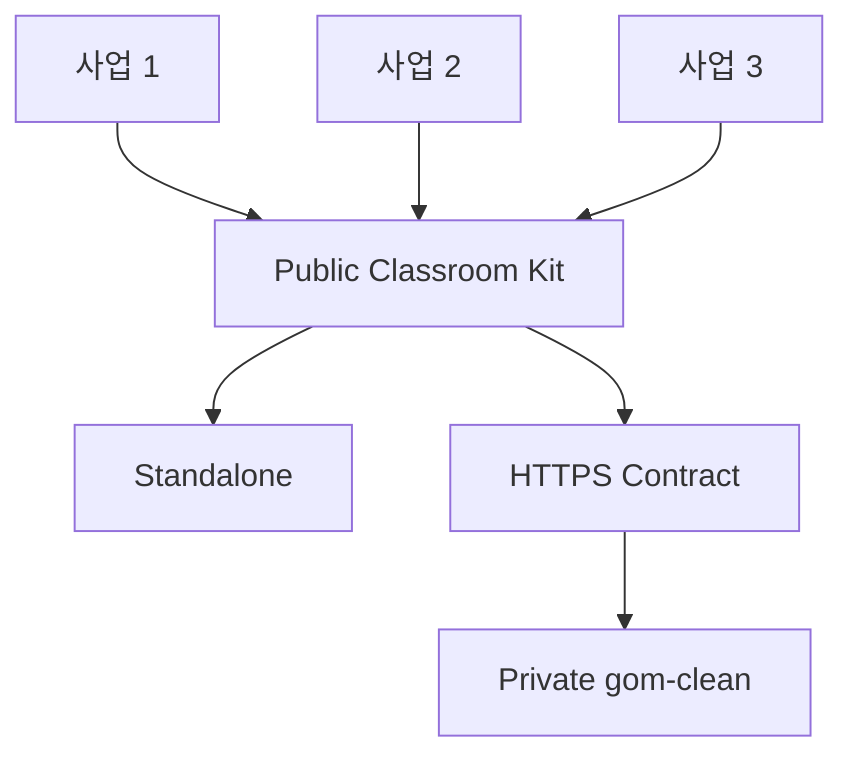

# Architecture

## 한 문장 구조

공개 Classroom Kit은 수업을 실행하고 결과카드를 만드는 클라이언트이며, 비공개 `gom-clean`은 인증·수업운영·수합·리포트를 담당하는 선택형 운영 플랫폼입니다.

## 핵심 원칙

1. **독립 실행 우선**: 네트워크 장애가 수업 핵심 성취를 막지 않아야 합니다.
2. **선택형 연결**: 수합·운영 기능이 필요할 때만 `gom-clean`을 사용합니다.
3. **소스코드 분리**: 공개 저장소는 비공개 저장소를 submodule, package 또는 checkout으로 가져오지 않습니다.
4. **클라이언트 불신**: 공개 코드는 누구나 바꿀 수 있으므로 서버가 모든 요청을 검증합니다.
5. **최소정보**: 팀코드와 학습증거만 다루고 실제 학생 식별정보를 수집하지 않습니다.

## 데이터 흐름

### 독립 실행

1. 브라우저에서 프로그램을 엽니다.
2. 팀코드와 활동 결과를 입력합니다.
3. 브라우저 로컬 저장소에 임시 저장합니다.
4. 결과카드를 JSON 파일로 내보냅니다.

네트워크 요청은 발생하지 않습니다.

### gom-clean 연결

아직 구현되지 않았습니다. 향후 다음 흐름만 허용합니다.

1. 교사가 `gom-clean`에서 수업을 시작합니다.
2. 학생 클라이언트가 짧은 참여코드를 제한 토큰으로 교환합니다.
3. 결과카드를 서버 API에 제출합니다.
4. 서버가 스키마·권한·용량·속도를 검증합니다.
5. 학교 결과보고에는 직접식별정보를 제거한 최소정보만 사용합니다.

## 버전 원칙

- 프로그램은 Semantic Versioning 형식의 버전을 가집니다.
- 결과카드에는 프로그램 버전과 스키마 버전을 함께 기록합니다.
- 운영 당일에는 고정된 프로그램 버전을 사용합니다.
- 규격을 깨는 변경은 새 스키마 메이저 버전으로 냅니다.

